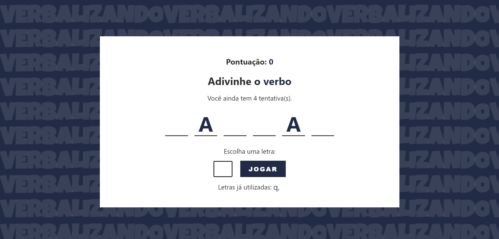

# Verbalizando
Verbalizando é um jogo estilo "jogo da forca", no qual o jogador deverá descobrir a palavra escolhendo uma letra do alfabeto por vez.

# Como jogar?

1ª Acesse o link: https://vitoria-almeida.github.io/verbalizando/;

2º Clique no botão JOGAR para iniciar o jogo;

3º Escolha uma letra por vez e tente descobrir qual é a palavra misteriosa;

4º Mas cuidado! Cada jogador só terá 5 chances de errar! Se o jogador acertar a palavra antes das chances esgotarem ele ganha o jogo, caso contrário ele perde.

 
 

